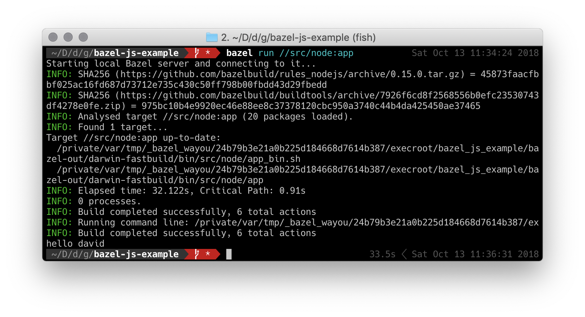

# Bazel JavaScript Examples

Examples demonstrate building JavaScript with Bazel.

<table>
    <tr>
        <td><a href="https://bazel.build/"></a></td>
        <td></td>
        <td><a href="https://nodejs.org/en/"></a></td>
        <td><a href="https://yarnpkg.com/en/"></a></td>
    </tr>
    <tr>
        <td>Bazel</td>
        <td>JavaScript</td>
        <td>NodeJs</td>
        <td>Yarn</td>
    </tr>
</table>


## Installing

Following the [official guide](https://docs.bazel.build/versions/master/install.html) to install bazel.


## Runnging the examples

Run `bazel query ...` for available targets.

For example, running the nodejs binary example:

```bash
$ bazel run //src/node:app
```

If everything goes well, it will print `hello, {name}`.




## What's included in this example

### 1. A basic setup for building JavaScript using bazel

#### bazel.rc

[bazel.rc](./tools/bazel.rc) contains the most common setup for bazel.
- `build --symlink_prefix=/` avoids creating symlinks like bazel-out in the project root. The output's annoy and cause performance issue with the editor.
- `query --output=label_kind` more usful when prints the `query` result with name and kind.


#### WORKSPACE

[WORKSPACE](./WORKSPACE) contains minimal setup for building the JavaScript code.

- load rules and setup for nodejs

```python
git_repository(
    name = "build_bazel_rules_nodejs",
    remote = "https://github.com/bazelbuild/rules_nodejs.git",
    tag = "0.15.0", # check for the latest tag when you install
)

load("@build_bazel_rules_nodejs//:package.bzl", "rules_nodejs_dependencies")
rules_nodejs_dependencies()
```

- install nodejs, npm and yarn for the project

```python
load("@build_bazel_rules_nodejs//:defs.bzl", "node_repositories")

# NOTE: this rule installs nodejs, npm, and yarn, but does NOT install
# your npm dependencies into your node_modules folder.
# You must still run the package manager to do this.
node_repositories(package_json = ["//:package.json"])
```

- Using Bazel-managed dependencies

```python
load("@build_bazel_rules_nodejs//:defs.bzl", "yarn_install")

yarn_install(
    name = "npm",
    package_json = "//:package.json",
    yarn_lock = "//:yarn.lock",
)
```


### 2. Buildifier

Using Buidifier form [bazelbuild/buildtools](https://github.com/bazelbuild/buildtools) to generate and format bazel files.

The setup code locates in the root `BUILD.bazel` file and format code with the following command:

```
$ bazel run //:buildifier
```


### 3. Loading and consume packages from npm

When runing bazel the first time, it will automatically install dependencies. Alternatively you can manually install by running:

```bash
$ bazel run @nodejs//:yarn
```

Access the npm packages within `BUILD.bazel` With the [fine-grained npm package dependencies](https://github.com/bazelbuild/rules_nodejs#fine-grained-npm-package-dependencies) setup in `WORKSPACE`.

```python
load("@build_bazel_rules_nodejs//:defs.bzl", "nodejs_binary")

nodejs_binary(
    name = "app",
    install_source_map_support = False,
    data = [
        "index.js",
        "lib.js",
        "@npm//lodash",
    ],
    entry_point = "bazel_js_example/src/node/index.js",
)

```

### 4. Running node binary from npm packages

Run the rollup binary example install from npm.

> all params after `--` will path through to the binary

```bash
$ bazel run //src/rollup:rollup -- -v
```

```python
nodejs_binary(
    name="rollup",
    install_source_map_support = False,
    entry_point = "rollup/bin/rollup",
    data = [
        "@npm//rollup",
    ],
)
```


### 5. Bundle js with rollup

Bundle js with `rollup_bundle` rules.

```bash
$ bazel build //src/rollup_bundle:bundle
```

```python
nodejs_binary(
    name="rollup",
    install_source_map_support = False,
    entry_point = "rollup/bin/rollup",
    data = [
        "@npm//rollup",
    ],
)
```

6. Stamping

*Currently not avaialbe. Refer https://github.com/bazelbuild/bazel/issues/1054 for more updates.*


### 7. Publishing to npm

Run `bazel build //src/npm_package:sample_package` to generate publishable files.

```python
load("@build_bazel_rules_nodejs//:defs.bzl", "npm_package")
npm_package(
    name = "sample_package",
    srcs = [
        "index.js",
        "lib.js",
        "package.json",
    ],
    replacements = {"//internal/": "//"},
    deps = [
        "@npm//lodash",
    ],
)
```


